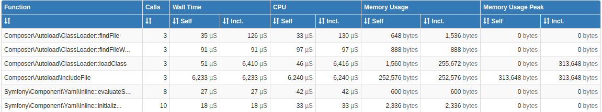
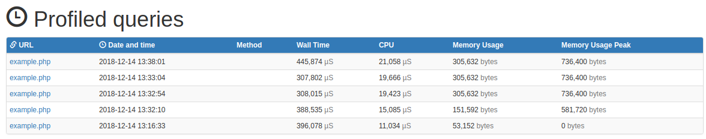
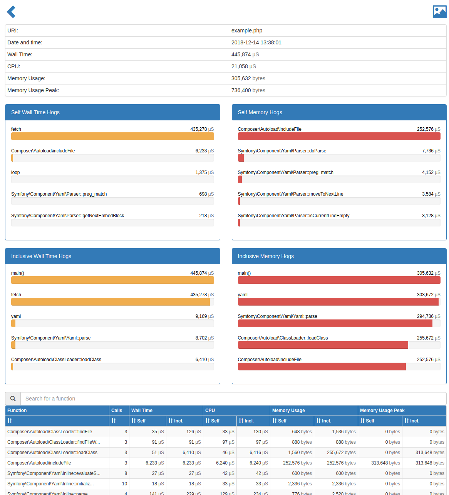
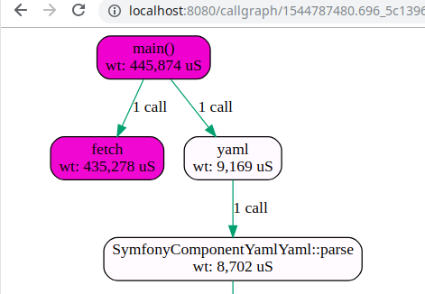

# Profiling PHP


Generic profiling implementation for PHP.

Has a browser based UI to view profiled calls.

Tested with *tideways* and *PHP 7.2* in *Ubuntu 18.04*.

All the code is based on a much older implementation that used *xhprof* and *PHP 5.x* (tested and used at least in *Ubuntu 14.04* and *CentOS/cPanel v???*).
Ported the code as a standalone version from *Kehikko v1* framework when starting *Kehikko v2*.

Should still work even with *PHP 5.x* since no changes have been made to the core functionality, but I made *PHP 7.0*
as a requirement when installing this from *Composer*.

## Requirements

***PHP 7.0***, PHP ***profiler extension*** (listed below), ***Twig***, ***Symfony Yaml*** and command ***dot*** (from GraphViz).

One of these PHP-extensions is required:

* tideways
* uprofiler
* xhprof

In *Ubuntu 18.04* you should be able to install and setup needed depencies manually this way:

```sh
apt install php-symfony-yaml php-twig # optional, will be installed through Composer
apt install php-tideways graphviz # these have to be installed manually
phpenmod tideways
```

## Install

```sh
composer require kehikko/profiler
```

If you plan to use this without *Composer*, you need to install *Twig* and *Symfony Yaml* manually so that they are autoloaded when
this profiler code is run.

The part that writes profiling data, needs only *Symfony Yaml*. The part that is used to view profiled calls, needs both.

## Setup

### Simple test example

Do the following in this project root after you have installed tideways and graphviz:

```sh
composer install
php example/example.php
php -S localhost:8080 web/index.php
```

And if you did this on your local machine, you should be able to browse to url `http://localhost:8080`
and see some results.

### Generating profiling data

Call `profiler_start`from your code. So far no `profiler_stop` is implemented, probably will be done in the future.

```php
/* do this somewhere in your startup code,
 * path to profiler data directory is optional, default shown here
 */
profiler_start('/tmp/kehikko-php-profiler');
```

### Apache

Enable *mod_rewrite* in Apache and add/set this to your `.htaccess` in your public web directory:

```
RewriteEngine on
RewriteCond %{REQUEST_FILENAME} !-f
RewriteRule ^_profiler(/.*)?$ profiler.php [NC,L,NE]
```

Create a PHP file called `profiler.php` in that same directory with following contents:

```php
<?php

require_once __DIR__ . '/../vendor/autoload.php';

/* show errors in browser, easier this way, this is not production stuff anyways */
error_reporting(E_ALL);
ini_set('display_errors', 1);

/* this should be given to later functions so that they are able to generate links correctly */
$root_url = '/_profiler/';
/* parse profiler "route" url */
$request_url = trim(substr($_SERVER['REQUEST_URI'], strlen($root_url)), '/');

/* path where profiling data is saved (same as given to profiler_start()), following is default */
$datapath = '/tmp/kehikko-php-profiler';
/* limit shown profiling entries to this number, default is 20 */
$limit = 20;

/* "route" */
if ($request_url == '') {
    /* to index */
    echo profiler_html_index($root_url, $datapath, $limit);
} else {
    /* to single call profile */
    $parts = explode('/', $request_url);
    $id    = array_pop($parts);
    if (strpos($request_url, 'graph/') === 0) {
        /* generate svg call graph */
        profiler_svg_graph_generate($id, $datapath);
    } else if (strpos($request_url, 'callgraph/') === 0) {
        /* view call graph */
        echo profiler_html_profile_call_graph($id, $root_url, $datapath);
    } else {
        /* view call profile */
        echo profiler_html_profile($id, $root_url, $datapath);
    }
}
```

Now you can see your profiled calls when browsing to `http://your.web.server/_profiler`.

**NOTE:** This script assumes that *Composer* installed `vendor` directory containing libraries is located one step down from the directory it is located in.

**NOTE:** At least in Ubuntu 18.04 systemd forces `/tmp/` in PHP with apache to a different location,
usually `/tmp/systemd-private-*-apache2.service-*/`. This is not the case when running PHP from command line,
so don't get baffled when profiling stuff in command line does not show up in your apache side.

## Screenshots

### Profiles


### Profile


### Call graph

